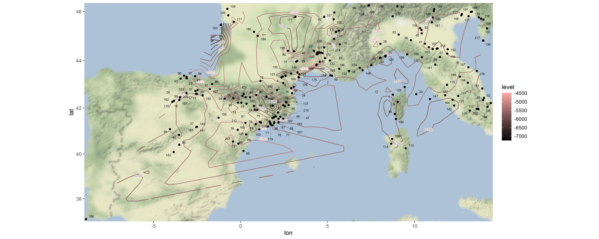
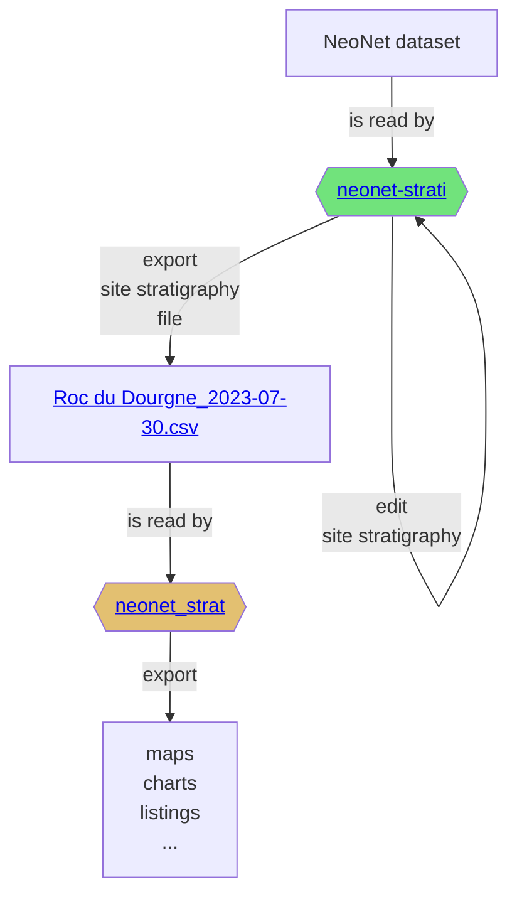

# NeoNet

NeoNet serves as a framework for researching the transition between the Late Mesolithic and Early Neolithic periods. It is composed of the [interactive app](https://github.com/zoometh/neonet#neonet-app--mapping-the-late-mesolithicearly-neolithic-transition-) and the [R package](https://github.com/zoometh/neonet#neonet-package)

## NeoNet app <br> <sub><sup>mapping the Late Mesolithic/Early Neolithic transition </sup></sub>
> <sub>[Thomas Huet](mailto:thomas.huet@arch.ox.ac.uk), [Niccolò Mazzucco](mailto:niccolo.mazzucco@unipi.it), [Miriam Cubas Morera](mailto:mcubas.morera@gmail.com), [Juan Gibaja](mailto:jfgibaja@gmail.com), [F. Xavier Oms](mailto:oms@ub.edu), [António Faustino Carvalho](mailto:a.faustino.carvalho@gmail.com), [Ana Catarina Basilio](mailto:catarinasbasilio@gmail.com), [Elías López-Romero](elias.lopez-romero@iam.csic.es)</sub>

NeoNet app is an R Shiny application for mapping radiocarbon (C14) dates from the Late Mesolithic/Early Neolithic transition in the North-Central Mediterranean and European South Atlantic river basin (<a href="https://github.com/zoometh/neonet/blob/main/doc/data/wsh_med.geojson" target="_blank">loc</a>). The application offers a mobile geographic window for date selection by location, various filters on chronology and date quality, a calibration window, and other tools to create a user-friendly interface supported by a curated dataset of radiocarbon dates and archaeological contexts. NeoNet app is hosted on the server of the University of Pisa. This NeoNet app uses this radiocarbon dataset: <a href="https://doi.org/10.13131/archelogicadata-yb11-yb66" target="_blank">https://doi.org/10.13131/archelogicadata-yb11-yb66</a> published as a data paper in the [Journal of Open Archaeology Data](https://openarchaeologydata.metajnl.com/articles/10.5334/joad.87) and describe in this [web document](https://zoometh.github.io/neonet/).

<p align="center">
<a href="http://shinyserver.cfs.unipi.it:3838/C14/" target="_blank"><b>NeoNet app</b></a> 
</p>
   
## NeoNet package <br> <sub><sup>radiocarbon management </sup></sub>
> <sub>[Thomas Huet](mailto:thomas.huet@arch.ox.ac.uk)</sub>

The `neonet` R package is under development. It enables the handling of radiocarbon dates sourced from the dataset or exported from the Shiny app: [SPD](https://github.com/zoometh/neonet#spd-plot), [isochrones](https://github.com/zoometh/neonet#isochrones), etc., and to build [Harris matrices](https://github.com/zoometh/neonet#harris-matrix) using the [NeoNet-strati app](https://github.com/zoometh/neonet#neonet-strati).

### Data preparation

Starting by running these `neo_*()` functions to manage a new XLSX dataset. Sourcing functions:

```R
source("R/neo_subset.R")
source("R/neo_bib.R")
source("R/neo_matlife.R")
source("R/neo_calib.R")
source("R/neo_merge.R")
source("R/neo_html.R")
source("R/neo_datamiss.R")
source("R/neo_datasum.R")
source("R/neo_doi.R")
```

Read the new dataset and bibliographic file

```R
data.c14 <- paste0(getwd(), "/inst/extdata/", "NeoNet_atl_ELR (1).xlsx")
df.bib <- paste0(getwd(), "/inst/extdata/", "NeoNet_atl_ELR.bib")
```

Cleaning the dataset and making it conform to the published <a href="https://doi.org/10.13131/archelogicadata-yb11-yb66" target="_blank">NeoNet dataset</a>

```R
df.c14 <- openxlsx::read.xlsx(data.c14)
df.c14 <- neo_subset(df.c14,
                     rm.C14Age = TRUE,
                     rm.Spatial = FALSE,
                     rm.Period = FALSE)
df.c14 <- neo_calib(df.c14)
neo_doi(df.c14)
```

Calculate basic statistics: missing data

```R
neo_datamiss(df.c14)
```

Prepare the dataset for the Shiny application by merging it with NeoNet Med, calculating materil life duration, and HTML popup layouts

```R
df.c14 <- neo_merge(df.c14 = df.c14, 
                    data.bib = data.bib, 
                    merge.bib = F)
df.c14 <- neo_matlife(df.c14)
df.c14 <- neo_html(df.c14)
```

Export the merged dataset

```R
write.table(df.c14, "C:/Rprojects/neonet/R/app-dev/c14_dataset_med_x_atl.tsv",
            sep = "\t",
            row.names = FALSE)
```

### SPD plot

Plot the SPD of the two datasets, once `df.c14` calculated

```R
library(rcarbon)

source("R/neo_spd.R")
source("R/neo_spdplot.R")

neo_spd(df.c14 = df.c14)
```

<p align="center">
<br>
  
  <br>
    <em>NeoNet dataset SPD with default period colors</em>
</p>


`neo_spd()` calls `neo_spdplo()`, adapted from `rcarbon::plot.stackCalSPD.R`, to fetch NeoNet default period colors.


### Isochrones

Create a map with isochrone contours to model the spread of Neolithic

```R
library(rcarbon)

source("R/neo_isochr.R")
source("R/neo_spd.R")

neo_isochr(df.c14 = "C:/Rprojects/neonet/results/2023-09-23-neonet-data.geojson")
```
  
The file [2023-09-23-neonet-data.geojson](https://github.com/zoometh/neonet/blob/main/results/2023-09-23-neonet-data.geojson) is an export from the NeoNet app (see "export dates" in the [web document](https://zoometh.github.io/neonet/#export_dates)). This dataset can be curated in a GIS before using the `neo_isochr()` function.


The output is a map with isochrones calculated on the median of calibrated Early Neolithic (EN) dates. 



### Harris Matrix

The output CSV file exported by [NeoNet-starti](https://github.com/zoometh/neonet#neonet-strati) can be read by the `neo_strat()` function. For example, ploting the `C14Age` and the `PhaseCode`.

```R
neo_strat(inData = 'https://raw.githubusercontent.com/historical-time/data-samples/main/neonet/Roc du Dourgne_2023-07-30.csv',
          outLabel = c("C14Age"))
neo_strat(inData = 'https://raw.githubusercontent.com/historical-time/data-samples/main/neonet/Roc du Dourgne_2023-07-30.csv',
          outLabel = c("PhaseCode"))
```
Gives:

<p align="center">
  
  
  <br>
    <em>"Roc du Dourgne" stratgraphical relationships using LabCode identifiers, ordered on the "LabCode" column, displaying the C14Age (left) and the LabCode (right)</em>
</p>

Changing the `outLabel` to `Period` allows to color on periods using the default period colors (see the [web document](https://zoometh.github.io/neonet/#3_data_panel))

```R
neo_strat(inData = 'https://raw.githubusercontent.com/historical-time/data-samples/main/neonet/Roc du Dourgne_2023-07-30.csv',
          outLabel = c("Period"))
```
Gives:

<p align="center">
  
  <br>
    <em>"Roc du Dourgne" stratgraphical relationships using LabCode identifiers, ordered on the "LabCode" column</em>
</p>

### Cultural Periods

Leapfrog is a 
Using `neo_leapfrog(DT = T)` to merge dataframe from NeoNet and Leapfrog on common C14 LabCode values: <https://historical-time.github.io/caa23/neonet/results/NN_and_LF.html>

<p align="center">
<br>
<em>Screen capture of [NN_and_LF.html](https://historical-time.github.io/caa23/neonet/results/NN_and_LF.html)</em>
</p>

## Neonet-strati

NeoNet-strati is an online R Shiny interactive app to record the stratigraphy of NeoNet's archaeological sites in an editable dataframe based on `LabCode` identifiers. 

<p align="center">
<a href="https://trainingidn.shinyapps.io/neonet-strati" target="_blank"><b>NeoNet-strati app</b></a> 
</p>

A site name is copied from [All sites panel](https://github.com/zoometh/neonet#all-sites-panel) to [Site Startigraphy panel](https://github.com/zoometh/neonet#site-startigraphy-panel).

<p align="center">
<br>
  
  <br>
    <em>"Roc du Dourgne" site sorted on its "PhaseCode"</em>
</p>

The stratigraphical relations can be added into the "After" column, and thereafter exported in CSV

<p align="center">
  
  <br>
    <em>"Roc du Dourgne" stratgraphical relationships (column "After") after edition</em>
</p>

For example, "Roc du Dourgne" relationships are:

|LabCode |After   |Period |PhaseCode | C14Age| C14SD|
|:-------|:-------|:------|:---------|------:|-----:|
|MC-1101 |MC-1102 |EN     |C5        |   5050|   100|
|MC-1102 |MC-1103 |EN     |C5        |   6170|   100|
|MC-1103 |MC-1105 |EN     |C6        |   5100|    80|
|MC-1104 |MC-1105 |EN     |C6        |   6470|   100|
|MC-1105 |MC-1107 |EN     |C6        |   5550|    80|
|MC-1107 |        |LM     |C7        |   6850|   100|
|MC-781  |        |EN     |C6        |   5000|   170|
|MC-782  |        |LM     |Layer 7   |   5770|   170|

The first row indicates that: "*the layer containing radiocarbon date MC-1101 comes after the layer containing radiocarbon date MC-1102*". 

Save the changes by downloading the dataset pressing the button (top-left) as a CSV file that can be read by the `neo_strati()` function (see [Harris Matrix](https://github.com/zoometh/neonet#harris-matrix))

### Worflow


### App interface

The app is composed by different panels: a site to be recorded ([Site Startigraphy panel](https://github.com/zoometh/neonet#site-startigraphy-panel)), and the complete dataset ([All sites panel](https://github.com/zoometh/neonet#all-sites-panel)).
#### Site Startigraphy panel

Plot a selected site in an editable table to record its stratigraphical relationships.

<p align="center">
  
  <br>
    <em>Panel "Site Stratigraphy" editable dataframe. By default the app opens on "Pokrovnik"</em>
</p>

#### All sites panel

Show the complete NeoNet dataset. A site can be selected by searching it in the selection search bar (top-right) and copying its name (`Site Name` column). Here Roc du Dourgne, highlighted in blue.

<p align="center">
<br>
  
  <br>
    <em>Panel "All sites". Selection of the "Roc du Dourgne" site</em>
</p>

## Documentation

* NeoNet app [web document](https://zoometh.github.io/neonet/)
* [Contribution rules](https://github.com/zoometh/neonet/blob/master/github/CONTRIBUTING.md)
* [NeoNet package license](https://github.com/zoometh/neonet/blob/master/LICENSE)
