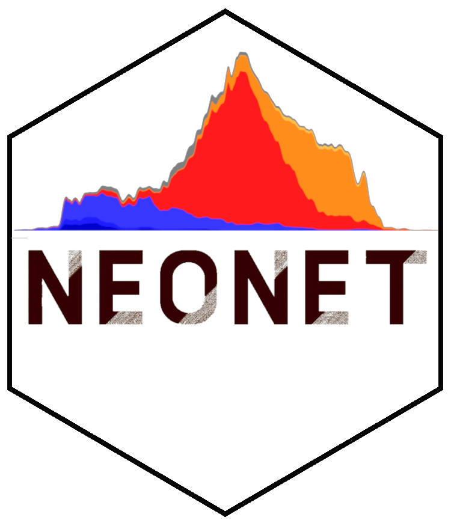
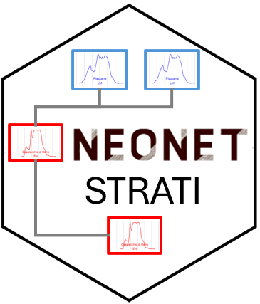
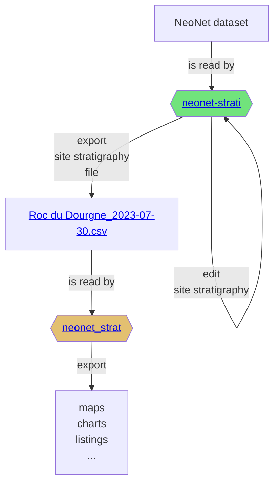

# NeoNet
> <sub>[Thomas Huet](mailto:thomas.huet@arch.ox.ac.uk), [Niccolò Mazzucco](mailto:niccolo.mazzucco@unipi.it), [Miriam Cubas Morera](mailto:mcubas.morera@gmail.com), [Juan Gibaja](mailto:jfgibaja@gmail.com), [F. Xavier Oms](mailto:oms@ub.edu), [António Faustino Carvalho](mailto:a.faustino.carvalho@gmail.com), [Ana Catarina Basilio](mailto:catarinasbasilio@gmail.com), [Elías López-Romero](elias.lopez-romero@iam.csic.es)</sub>

NeoNet serves as a framework to investigate the transition between the Late Mesolithic and Early Neolithic periods, in the North-Central Mediterranean (<a href="https://github.com/zoometh/neonet/blob/main/doc/data/wsh_med.geojson" target="_blank">loc</a>) and European South Atlantic river basin (<a href="https://github.com/zoometh/neonet/blob/main/doc/data/wsh_atl.geojson" target="_blank">loc</a>), by offering:
1. [curated datasets](https://github.com/zoometh/neonet?tab=readme-ov-file#neonet-datasets)
2. [interactive app](https://github.com/zoometh/neonet#neonet-app--mapping-the-late-mesolithicearly-neolithic-transition-);
3. [R functions](https://github.com/zoometh/neonet#neonet-functions--radiocarbon-management-)

<p align="center">
<br>
  
  
  <br>
    <em>The NeoNet Med and NeoNet Atl datasets filtered by periods</em>
</p>

Studied periods are listed in the [periods.tsv](https://github.com/zoometh/neonet/blob/main/inst/extdata/periods.tsv) table:

| period | period_full_name             | color                                                                 |
|--------|------------------------------|-----------------------------------------------------------------------|
| EM     | Early Mesolithic             |               |
| MM     | Middle Mesolithic            |               |
| LM     | Late Mesolithic              |               |
| LMEN   | Late Mesolithic/Early Neolithic |            |
| UM     | Undefined Mesolithic         |               |
| EN     | Early Neolithic              |               |
| EMN    | Early/Middle Neolithic       |               |
| MN     | Middle Neolithic             |               |
| LN     | Late Neolithic               |               |
| UN     | Undefined Neolithic          |               |


## NeoNet datasets

<div align="center">

| Med 	| Atl 	|
|------	|-----	|
| [id00140_doc_elencoc14.tsv](https://github.com/zoometh/neonet/blob/main/inst/extdata/id00140_doc_elencoc14.tsv)     	| [id00164_doc_elencoc14.tsv](https://github.com/zoometh/neonet/blob/main/inst/extdata/id00164_doc_elencoc14.tsv)   	|
| <a href="https://github.com/zoometh/neonet/blob/main/doc/data/wsh_med.geojson"></a> | <a href="https://github.com/zoometh/neonet/blob/main/doc/data/wsh_atl.geojson"></a> |

</div>

These datasets are harvested by the [c14bazAAR package](https://github.com/ropensci/c14bazAAR), functions `get_c14data("neonet")` and `get_c14data("neonetatl")`


## NeoNet app <br> <sub><sup>mapping the Late Mesolithic/Early Neolithic transition </sup></sub>


NeoNet app is an R Shiny application for mapping radiocarbon (C14). The application offers a mobile geographic window for date selection by location, various filters on chronology and date quality, a calibration window, and other tools to create a user-friendly interface supported by curated datasets of radiocarbon dates and archaeological contexts. NeoNet app is hosted on the server of the University of Pisa. This NeoNet app uses this radiocarbon dataset: <a href="https://doi.org/10.13131/archelogicadata-yb11-yb66" target="_blank">https://doi.org/10.13131/archelogicadata-yb11-yb66</a> published as a data paper in the [Journal of Open Archaeology Data](https://openarchaeologydata.metajnl.com/articles/10.5334/joad.87) and describe in this [web document](https://zoometh.github.io/neonet/).

<p align="center">
<a href="http://shinyserver.cfs.unipi.it:3838/C14/" target="_blank"><b>NeoNet app</b></a> 
</p>

<p align="center">
<a href="http://shinyserver.cfs.unipi.it:3838/C14dev/" target="_blank">NeoNet app <em>dev</em></a> 
</p>

### TODO

- On export action (download button), export this metadata:
  + max SD
  + selected periods
  + dataset (Med, Atl) DOI
  + timestamp
  + bibliographical reference

## NeoNet functions <br> <sub><sup>radiocarbon management </sup></sub>

NeoNet functions enable the handling of radiocarbon dates sourced from the dataset or exported from the [interactive app](https://github.com/zoometh/neonet#neonet-app--mapping-the-late-mesolithicearly-neolithic-transition-). Current functions cover:

* [data management](https://github.com/zoometh/neonet#data-preparation)
* [SPD](https://github.com/zoometh/neonet#spd-plot)
* [isochrones](https://github.com/zoometh/neonet#isochrones)
* [Koppen climate classes](https://github.com/zoometh/neonet#koppen)
* [Harris matrices](https://github.com/zoometh/neonet#harris-matrix) using the [NeoNet-strati app](https://github.com/zoometh/neonet#neonet-strati).

### Data

#### Data preparation

Starting by running these `neo_*()` functions to manage a new XLSX dataset. Sourcing functions:

```R
source("R/neo_subset.R")
source("R/neo_bib.R")
source("R/neo_matlife.R")
source("R/neo_calib.R")
source("R/neo_merge.R")
source("R/neo_html.R")
source("R/neo_datamiss.R")
source("R/neo_datasum.R")
source("R/neo_doi.R")
```

Read the new dataset and bibliographic file

```R
data.c14 <- paste0(getwd(), "/inst/extdata/", "NeoNet_atl_ELR (1).xlsx")
df.bib <- paste0(getwd(), "/inst/extdata/", "NeoNet_atl_ELR.bib")
```

Cleaning the dataset and making it conform to the published <a href="https://doi.org/10.13131/archelogicadata-yb11-yb66" target="_blank">NeoNet dataset</a>

```R
df.c14 <- openxlsx::read.xlsx(data.c14)
df.c14 <- neo_subset(df.c14,
                     rm.C14Age = TRUE,
                     rm.Spatial = FALSE,
                     rm.Period = FALSE)
df.c14 <- neo_calib(df.c14)
neo_doi(df.c14)
```

Prepare the dataset for the Shiny application by merging it with NeoNet Med, calculating materil life duration, and HTML popup layouts

```R
df.c14 <- neo_merge(df.c14 = df.c14, 
                    data.bib = data.bib, 
                    merge.bib = F)
df.c14 <- neo_matlife(df.c14)
df.c14 <- neo_html(df.c14)
```

Export the merged dataset

```R
write.table(df.c14, "C:/Rprojects/neonet/R/app-dev/c14_dataset_med_x_atl.tsv",
            sep = "\t",
            row.names = FALSE)
```

#### Data report

Calculate basic statistics

```R
neo_datasum(df.c14)
```

Calculate basic statistics: missing data

```R
neo_datamiss(df.c14)
```

<p align="center">
<br>
  
  <br>
    <em>Missing data (empty cells)</em>
</p>

#### Data alignment

Parse and align c14bazAAR data with the Neonet layout

```R
source("R/neo_dbs_parse.R")
source("R/neo_dbs_align.R")

l.dbs <- c("calpal", "medafricarbon", "agrichange", "bda", "calpal", "radon", "katsianis") 
col.c14baz <- c("sourcedb", "site", "labnr", "c14age", "c14std", "period", "culture", "lon", "lat")
df <- neo_dbs_parse(l.dbs = l.dbs,
                    col.c14baz = col.c14baz)
df.c14 <- neo_dbs_align(df)
```

These other databases suffer issues:

| db name  | Header 2 |
|----------|----------|
| 14sea    | No lat / lon information, spatialisation should be done on site name  |
| neonet   | Timeout, the server URL returns a `ERR_CONNECTION_TIMED_OUT`  |
| p3k14c   | Cultural information (`culture` and `period`) is largely missing  |

Foreign dates aggregated though the c14bazAAR can be audited, for example: "Alg-40"


To retrieve dates coming from other databases (with the [c14bazAAR](https://github.com/ropensci/c14bazAAR) R package) and mapped to be compliant with the Neonet format and functions, using `neo_dbs_parse()`, a mapping table (XLSX) created with `neo_dbs_create_ref()`, and `neo_dbs_align()`:

```R
when <- c(-9000, -4000)
where <- sf::st_read("https://raw.githubusercontent.com/zoometh/neonet/main/doc/talks/2024-simep/roi.geojson",
                     quiet = TRUE)

# collect the dates form different DBs, standardize the cultural period layout, filter on 'when' and 'where'
df <- neo_dbs_parse(l.dbs = c("bda", "medafricarbon"), 
                    col.c14baz = c("sourcedb", "site", "labnr", "c14age", "c14std", "period", "culture", "lon", "lat"),
                    chr.interval.uncalBC = when, 
                    roi = where)

# create the mapping file
neo_dbs_create_ref(df.all.res = df,
                   root.path = "C:/Rprojects/neonet/results",
                   outFile = "df_ref_per.xlsx")
```

This mapping file [ref_table_per.xlsx](https://github.com/zoometh/neonet/blob/main/doc/ref_table_per.xlsx) is a reference table to map cultural assessment coming from external DBs, collected throug c14bazAAR, to the Neonet one (..., LM, EN, ...) format. This XLSX file has to be updated manually by specialists. 

<p align="center">
<br>
  
  <br>
    <em>The neonet dataset over the KCC 7k</em>
</p>

The `neo_dbs_align()` function reuses this mapping table. 

```R
df.c14 <- neo_dbs_align(df,
                        mapping.file = "C:/Rprojects/neonet/doc/ref_table_per.xlsx")
head(df.c14)
```

Gives a dataframe where all fields have been renamed to be parsed with the Neonet functions. Among this mapping the column 'Period' with, for example, `MM`  Middle Mesolithic) maps the `bda` period = `Mésolithique 1` and culture = `Capsien ancien` or `Capsien typique`:

| sourcedb | SiteName       | LabCode  | C14Age | C14SD | db_period      | db_culture      | Period | lon      | lat     |
|----------|----------------|----------|--------|-------|----------------|-----------------|--------|----------|---------|
| bda      | Mechta el Arbi | Poz-92231| 6600   | 80    | Mésolithique 1 | Capsien ancien  | MM     | 6.130900 | 36.09940|
| bda      | Mechta el Arbi | Poz-92232| 6250   | 130   | Mésolithique 1 | Capsien ancien  | MM     | 6.130900 | 36.09940|
| bda      | Mechta el Arbi | Poz-92230| 3500   | 120   | Mésolithique 1 | Capsien ancien  | MM     | 6.130900 | 36.09940|
| bda      | Kef Zoura D    | UOC-2925 | 7787   | 48    | Mésolithique 1 | Capsien typique | MM     | 7.682121 | 35.04205|
| bda      | Bortal Fakher  | L-240A   | 6930   | 200   | Mésolithique 1 | Capsien typique | MM     | 8.176087 | 34.35480|
| bda      | Relilaï (B)    | Gif-1714 | 7760   | 180   | Mésolithique 1 | Capsien typique | MM     | 7.694694 | 35.04480|

#### Outlier dates

To filter aberrant dates, a combination of different function allow to retrieve the current information (once mapped to the Neonet layout) of these potential outliers and their original information (from their source database).


<p align="center">
<br>
  
  <br>
    <em>KCC and isochrone for 8000 calBC (10ka BP). Here the dates 147 (circled in red), 198 and 367 seem aberrant</em>
</p>


```R
source("R/neo_find_date.R")

abber.date <- neo_find_date(df = isochr$data, idf.dates = 147)
```

Gives:

```
idf sourcedb labcode     site   median period
147   calpal UBAR-31 Cova 120 -8040.05     EN
```

Where `147` is the contextual identifier of the date. This date comes from the `calpal` DB. The calibrated radiocarbon date median (`-8040.05`) is really too high for an `EN` period (Early Neolithic). Running the followin functions helps to contextualize the date.

```R
source("R/neo_dbs_info_date_src.R")

abber.date <- neo_dbs_info_date(abber.date$labcode)
```

Gives:

```
     sourcedb LabCode SiteName   median db_period db_culture
3451   calpal UBAR-31 Cova 120 -8040.05 Neolithic Epicardial
```

The date `147` (aka `UBAR-31`) is tagged `Neolithic` and `Epicardial` in `calpal`. To have its full record, as it is created using the c14bazAAR package, run:


```R
source("R/neo_dbs_info_date.R")

neo_dbs_info_date_src(db = abber.dates$sourcedb, 
                      LabCode = abber.dates$LabCode)
```

Gives:

```
  sourcedb sourcedb_version method   labnr c14age c14std c13val     site sitetype    period    culture material species country
2   calpal       2020-08-20    14C UBAR-31   8550    150      0 Cova 120     <NA> Neolithic Epicardial charcoal    <NA>   Spain
    lat  lon          shortref
2 42.47 2.61 van Willigen 2006
```

The list of aberrant dates, for example [c14_aberrant_dates.tsv](https://github.com/zoometh/neonet/blob/main/inst/extdata/c14_aberrant_dates.tsv), is used to discard some dates with the `neo_dbs_rm_date()` function

```R
source("R/neo_dbs_rm_date.R")

df_filtered <- neo_dbs_rm_date(df.c14)
```

By default, dates having a dash prefix in their `sourcedb` column will be skipped (ex: `-radon`)

<p align="center">
<br>
  
  <br>
    <em>Screenshot of the 'c14_to_remove.tsv' table</em>
</p>

A template script to run this operatin: [run_outliers.R](https://github.com/zoometh/neonet/blob/main/doc/run_outliers.R)

#### Wrong coordinates

Site coordinates can be wrong, for example for the Jordian site of Sabha ([Xronos](https://xronos.ch/sites/12960) | [Google maps](https://maps.app.goo.gl/r4GEuFyzwysAwLe89)). Curated coordinates are listed in the [c14_corrected_coordinates.tsv](https://github.com/zoometh/neonet/blob/main/inst/extdata/c14_corrected_coordinates.tsv) file and handle by the `neo_dbs_coord_dates()` function.


### SPD plot

Plot the summed probabilty densities (SPD) of the two datasets, once `df.c14` calculated. The function `neo_spd()` calls `neo_spdplot()`. The latter has been adapted from `rcarbon::plot.stackCalSPD.R`, to fetch NeoNet default period colors.

```R
library(rcarbon)

source("R/neo_spd.R")
source("R/neo_spdplot.R")

neo_spd(df.c14 = df.c14)
```

<p align="center">
<br>
  
  <br>
    <em>NeoNet dataset SPD with default period colors</em>
</p>


`neo_spd()` can be run on a GeoJSON file exported from the NeoNet app (see "export dates" in the [web document](https://zoometh.github.io/neonet/#export_dates). For example [neonet-data-2023-09-24.geojson](https://github.com/zoometh/neonet/blob/main/results/neonet-data-2023-09-24.geojson), see also: [isochrones](https://github.com/zoometh/neonet#isochrones)

```R
neo_spd(df.c14 = "https://raw.githubusercontent.com/zoometh/neonet/main/results/neonet-data-2023-09-24.geojson",
        export = T)
```

### Isochrones

Create a map with isochrone contours to model the spread of Neolithic. 

The file [neonet-data-2023-09-24.geojson](https://github.com/zoometh/neonet/blob/main/results/neonet-data-2023-09-24.geojson) is an export from the NeoNet app (see "export dates" in the [web document](https://zoometh.github.io/neonet/#export_dates)). This GeoJSON file can be curated in a GIS (ex: removing aberrant dates) before running the following functions (`neo_isochr`, `neo_spd`, etc.).

<p align="center">
<br>
  
  <br>
    <em>Screen capture of the NeoNet app before the export of the `neonet-data-2023-09-24.geojson` file: Early Neolithic (EN) dates only having a SD ≤ 50, and calBC interval between -7000 and -3000</em>
</p>

The output is a map with isochrones calculated on the median of calibrated dates.

```R
library(rcarbon)

source("R/neo_isochr.R")
source("R/neo_spd.R")
source("R/neo_calib.R")

neo_isochr(df.c14 = "https://raw.githubusercontent.com/zoometh/neonet/main/results/neonet-data-2023-09-24.geojson", 
           show.lbl = FALSE)
```

Where `neo_calib()` calculate the cal BC min and max (i.e, calibrates), and the medidan (with 'intcal20' and the [Bchron](https://andrewcparnell.github.io/Bchron/) R package)

<p align="center">
<br>
  
  <br>
    <em>Output map from the `neonet-data-2023-09-24.geojson`</em>
</p>

#### Earliest Neolithic and Latest Paleolithic

The same function can be used symetrically: instead of plotting the earliest dates of the Neolithic, one can also plot the latest dates of the Paleolithic

```R
myc14data <- "https://raw.githubusercontent.com/zoometh/neonet/main/results/1_AOI_France_E-W.geojson"
neo_isochr(df.c14 = myc14data, mapname = "France_EW")
neo_isochr(df.c14 = myc14data, mapname = "France_EW", selected.per = c("LM"))
```

<p align="center">
<br>
  
  
  <br>
    <em>Output maps from the `1_AOI_France_E-W.geojson`: earliest Neolithic dates and latest Paleolithic dates</em>
</p>

## Koppen
> KCC, Koppen Climate Classification, Koeppen Climate Classification 

The app integrates Koppen Climate Classification (KCC) for 6,000 BP to 10,000 BP created with the R [pastclim](https://github.com/EvolEcolGroup/pastclim) package and the `neo_kcc_create()` function.

<p align="center">
<br>
  
  <br>
    <em>The Koppen Climate Classification calculated for 8,000 BP (8k) with the pastclim R package and hosted on a GeoServer </em>
</p>

Neonet functions help to blend pastclim KCC and radiocarbon dates.

```R
# install the packages pastclim and terra
devtools::install_github("EvolEcolGroup/pastclim", ref="dev")
library(pastclim)
library(terra)

# set paths and create maps
outDir <- "C:/Rprojects/neonet/doc/data/clim/"
pastclim::set_data_path(path_to_nc = outDir)

source("R/neo_kcc_create.R")
neo_kcc_create()
```

Creates these KCC GeoTiffs:

<a name="kcc-past"></a> KCC are created as GeoTiffs using the R pastclim package

| Geotiff image | description |
|----------|----------|
| |koppen_11k|
| |koppen_10k|
| |koppen_9k|
| |koppen_8k|
| |koppen_7k|
| |koppen_6k|

<em>Past Koppen Climate Classification calculated in Kyears BP with the pastclim R package</em>

### Classes

The Koppen Climate Classes are listed [here](https://github.com/zoometh/neonet/blob/main/inst/extdata/koppen.tsv)

| code |   num | value                                    | hexa color   | color                                                    |
|------------|-------:|:------------------------------------------|:-------|:---------------------------------------------------------|
| Af         |      1 | Tropical, rainforest                      | 0000FF |  |
| Am         |      2 | Tropical, monsoon                         | 0078FF |  |
| Aw         |      3 | Tropical, savannah                        | 46AAF  |     |
| BWh        |      4 | Arid, desert, hot                         | FF0000 |  |
| BWk        |      5 | Arid, desert, cold                        | FF9696 |  |
| BSh        |      6 | Arid, steppe, hot                         | F5A500 |  |
| BSk        |      7 | Arid, steppe, cold                        | FFDC64 |  |
| Csa        |      8 | Temperate, dry summer, hot summer         | FFFF00 |  |
| Csb        |      9 | Temperate, dry summer, warm summer        | C8C800 |  |
| Csc        |     10 | Temperate, dry summer, cold summer        | 969600 |  |
| Cwa        |     11 | Temperate, dry winter, hot summer         | 96FF96 |  |
| Cwb        |     12 | Temperate, dry winter, warm summer        | 64C864 |  |
| Cwc        |     13 | Temperate, dry winter, cold summer        | 329632 |  |
| Cfa        |     14 | Temperate, no dry season, hot summer      | C8FF50 |  |
| Cfb        |     15 | Temperate, no dry season, warm summer     | 64FF50 |  |
| Cfc        |     16 | Temperate, no dry season, cold summer     | 32C800 |  |
| Dsa        |     17 | Cold, dry summer, hot summer              | FF00FF |  |
| Dsb        |     18 | Cold, dry summer, warm summer             | C800C8 |  |
| Dsc        |     19 | Cold, dry summer, cold summer             | 963296 |  |
| Dsd        |     20 | Cold, dry summer, very cold winter        | 966496 |  |
| Dwa        |     21 | Cold, dry winter, hot summer              | AAAF   |        |
| Dwb        |     22 | Cold, dry winter, warm summer             | 5A78DC |  |
| Dwc        |     23 | Cold, dry winter, cold summer             | 4B50B4 |  |
| Dwd        |     24 | Cold, dry winter, very cold winter        | 320087 |  |
| Dfa        |     25 | Cold, no dry season, hot summer           | 00FFFF |  |
| Dfb        |     26 | Cold, no dry season, warm summer          | 37C8FF |  |
| Dfc        |     27 | Cold, no dry season, cold summer          | 007D7D |  |
| Dfd        |     28 | Cold, no dry season, very cold winter     | 00465F |  |
| ET         |     29 | Polar, tundra                             | B2B2B2 |  |
| EF         |     30 | Polar, frost                              | 666666 |  |

### Koppen functions

Koppen functions are designed not only for the Neonet dataset, but also for all radiocarbon dataset respecting the minimum data stracture (site, labcode, x, y, etc.).

The `neo_kcc_map()` creates a KCC map with a layer of dates above

```R
source("R/config.R") # default variables: column names mapping, colors, etc.

df <- c14bazAAR::get_c14data("neonet")
df <- sf::st_as_sf(df, coords = c("lon", "lat"), crs = 4326)
neo_kcc_map(df.c14 = df,
            kcc = "C:/Rprojects/neonet/doc/data/clim/koppen_7k.tif",
            export = TRUE,
            fileOut = "neonet_kcc.png" )
```

Gives:

<p align="center">
<br>
  
  <br>
    <em>The neonet dataset over the KCC 7k</em>
</p>

Or:

```R


```

To assess what were the climates classes that where inhabited in the past, during the Late Mesolithic (LM) and Middle Mesolithic (MM) based on previous dates

```R
df.c14 <- neo_calib(df.c14)
df.c14 <- sf::st_as_sf(df.c14, coords = c("lon", "lat"), crs = 4326)
kcc.file <- c("koppen_6k.tif", "koppen_7k.tif", "koppen_8k.tif",
              "koppen_9k.tif", "koppen_10k.tif", "koppen_11k.tif")
df_cc <- neo_kcc_extract(df.c14 = df.c14, kcc.file = kcc.file)
col.req <- gsub(pattern = ".tif", "", kcc.file)
neo_kcc_plotbar(df_cc = df_cc, 
                kcc.file = c("koppen_8k.tif", "koppen_9k.tif"),
                col.req = col.req,
                selected.per = c("EN"),
                title = "Neolithic: transition btw 7,000 and 6,000 BC",
                legend.show = FALSE)
```

Gives:

<p align="center">
<br>
  
  <br>
    <em>KCC occupied during the EN between 7,000 and 6,000 BC (9 ka and 8 ka BP) with counts of sites belonging to these time slices</em>
</p>

The `neo_kcc_extract()` function collects the KCC values (climates) of each date. 


## NeoNet strati <br> 

NeoNet-strati is an online R Shiny interactive app to record the stratigraphy of NeoNet's archaeological sites in an editable dataframe based on `LabCode` identifiers. 

<p align="center">
<a href="https://trainingidn.shinyapps.io/neonet-strati" target="_blank"><b>NeoNet-strati app</b></a> 
</p>



<p align="center">
<em> Strati app and strati analysis overall Workflow </em>
</p>

### App interface

The app is composed by different panels: a site to be recorded ([Site Stratigraphy panel](https://github.com/zoometh/neonet#site-stratigraphy-panel)), and the complete dataset ([All sites panel](https://github.com/zoometh/neonet#all-sites-panel)). A site name is copied from [All sites panel](https://github.com/zoometh/neonet#all-sites-panel) to [Site Stratigraphy panel](https://github.com/zoometh/neonet#site-stratigraphy-panel).

#### Site Stratigraphy panel

Plot a selected site in an editable table to record its stratigraphical relationships.

<p align="center">
  
  <br>
    <em>Panel "Site Stratigraphy" editable dataframe. By default the app opens on "Pokrovnik"</em>
</p>

#### All sites panel

Show the complete NeoNet dataset. A site can be selected by searching it in the selection search bar (top-right) and copying its name (`Site Name` column). Here Roc du Dourgne, highlighted in blue.

<p align="center">
<br>
  
  <br>
    <em>Panel "All sites". Selection of the "Roc du Dourgne" site</em>
</p>


<p align="center">
<br>
  
  <br>
    <em>"Roc du Dourgne" site sorted on its "PhaseCode"</em>
</p>

The stratigraphical relations can be added into the "After" column, and thereafter exported in CSV

<p align="center">
  
  <br>
    <em>"Roc du Dourgne" stratgraphical relationships (column "After") after edition</em>
</p>

For example, "Roc du Dourgne" relationships are:

|LabCode |After   |Period |PhaseCode | C14Age| C14SD|
|:-------|:-------|:------|:---------|------:|-----:|
|MC-1101 |MC-1102 |EN     |C5        |   5050|   100|
|MC-1102 |MC-1103 |EN     |C5        |   6170|   100|
|MC-1103 |MC-1105 |EN     |C6        |   5100|    80|
|MC-1104 |MC-1105 |EN     |C6        |   6470|   100|
|MC-1105 |MC-1107 |EN     |C6        |   5550|    80|
|MC-1107 |        |LM     |C7        |   6850|   100|
|MC-781  |        |EN     |C6        |   5000|   170|
|MC-782  |        |LM     |Layer 7   |   5770|   170|

The first row can be read as: "*the layer containing radiocarbon date MC-1101 comes **after** the layer containing radiocarbon date MC-1102*". 

Once the site stratigraphy recorded, save the changes by downloading the dataset pressing the button (top-left) as a CSV file. The output file name is the site name and the current date (ex: `Roc du Dourgne_2024-04-12.csv`).

### Strati analysis

The file exported from the NeoNet strati app can be read by the `neo_strati()` function (see [Harris Matrix](https://github.com/zoometh/neonet#harris-matrix))

#### Harris Matrix

The output CSV file exported by [NeoNet-strati](https://github.com/zoometh/neonet#neonet-strati) can be read by the `neo_strat()` function. For example, ploting the `C14Age` and the `PhaseCode`.

```R
neo_strat(inData = 'https://raw.githubusercontent.com/historical-time/data-samples/main/neonet/Roc du Dourgne_2023-07-30.csv',
          outLabel = c("C14Age"))
neo_strat(inData = 'https://raw.githubusercontent.com/historical-time/data-samples/main/neonet/Roc du Dourgne_2023-07-30.csv',
          outLabel = c("PhaseCode"))
```
Gives:

<p align="center">
  
  
  <br>
    <em>"Roc du Dourgne" stratgraphical relationships using LabCode identifiers, ordered on the "LabCode" column, displaying the C14Age (left) and the LabCode (right)</em>
</p>

Changing the `outLabel` to `Period` allows to color on periods using the default period colors (see the [web document](https://zoometh.github.io/neonet/#3_data_panel))

```R
neo_strat(inData = 'https://raw.githubusercontent.com/historical-time/data-samples/main/neonet/Roc du Dourgne_2023-07-30.csv',
          outLabel = c("Period"))
```
Gives:

<p align="center">
  
  <br>
    <em>"Roc du Dourgne" stratgraphical relationships using LabCode identifiers, ordered on the "LabCode" column</em>
</p>


## Leafrog alignment

Using `neo_leapfrog(DT = T)` to merge dataframe from NeoNet and Leapfrog on common C14 LabCode values: <https://historical-time.github.io/caa23/neonet/results/NN_and_LF.html>

<p align="center">
<br>
<em>Screen capture of [NN_and_LF.html](https://historical-time.github.io/caa23/neonet/results/NN_and_LF.html)</em>
</p>

## Sibling projects

There are mainy IT-based projects dealing with radiocarbon dates, such as the comprehensive platform [Xronos](https://xronos.ch/), the radiocarbon aggregator [C14bazAAR](https://github.com/ropensci/c14bazAAR), and many others, see the [open-archaeo](https://open-archaeo.info/tags/radiocarbon-dating-calibration-and-sequencing/) site


## Documentation

* NeoNet app [web document](https://zoometh.github.io/neonet/)
* [Contribution rules](https://github.com/zoometh/neonet/blob/master/github/CONTRIBUTING.md)
* [NeoNet package license](https://github.com/zoometh/neonet/blob/master/LICENSE)

## Communication

* Big Historical Data Conference
  - Shiny server (with the app embeded): http://shinyserver.cfs.unipi.it:3838/neonet/bhdc
  - GitHub (without the app embeded): https://zoometh.github.io/neonet/doc/talks/2023-bhdc
* Neonet workshop
  - GitHub: https://zoometh.github.io/neonet/doc/talks/2024-neonet-ws/pres
* SIMEP
  - GitHub: https://zoometh.github.io/neonet/doc/talks/2024-simep/pres
    
