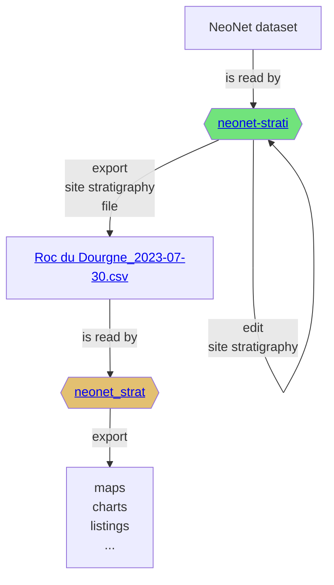

# NeoNet stratigraphy
> Creating Bayesian modelling for radiocarbon dates and stratigraphy of the **NeoNet** dataset

NeoNet [online app](http://shinyserver.cfs.unipi.it:3838/C14/) (see also [GitHub](https://github.com/zoometh/neonet)) dynamically maps radiocarbon dates of the Mesolithic/Neolithic transition, and records other contextual information (stratigraphic units, cultural periods, etc.). We bringing new developments for analysis of radiocarbon dates:

1. build the [stratigraphy](https://github.com/historical-time/caa23/tree/main/neonet#stratigraphy) of these archaeological sites;

2. merged [cultural periods](https://github.com/historical-time/caa23/tree/main/neonet#cultural-periods) from the https://devr.cepam.cnrs.fr/shinyapps/leap/ application with this model;

## Stratigraphy

To reconstruct site stratigraphies we will use Harris matrices.


https://github.com/historical-time/data-samples/blob/main/neonet/Roc%20du%20Dourgne_2023-07-30.csv

"neonet-strati" is an  Shiny interactive app, while `neonet_strat` is a R function.

### neonet-strati

neonet-strati is an [online R Shiny interactive app](https://trainingidn.shinyapps.io/neonet-strati/). It is composed of an editable dataframe,"Site Startigraphy" (first tab panel), and the complete dataset "All sites"  (second tab panel)[^1]. 

The first tab panel, "Site Startigraphy", samples a site from the NeoNet dataset and allow to edit its stratigraphical relationships.

<p align="center">
  
  <br>
    <em>Panel "Site Stratigraphy" editable dataframe. By default the app opens on "Pokrovnik"</em>
</p>

The second tab panel, "All sites", the whole dataset. A specific site can be selected in the selection search bar (top-right). Then the Site Name can be copied from the SiteName column (highlighted in blue)

<p align="center">
  
  <br>
    <em>Panel "All sites". Selection of the "Roc du Dourgne" site</em>
</p>

And copied into the bar "select a site name", in the tab panel "Site Stratigraphy"

<p align="center">
  
  <br>
    <em>Panel "Site Stratigraphy" editable dataframe. "Roc du Dourgne" site, ordered on the "Period" column</em>
</p>

The startigraphical relationships, using "LabCode", can be added into the "After" column, and thereafter exported in CSV

<p align="center">
  
  <br>
    <em>"Roc du Dourgne" stratgraphical relationships (column "After") using LabCode identifiers, ordered on the "LabCode" column</em>
</p>

For example, "Roc du Dourgne" relationships are:

|LabCode |After   |Period |PhaseCode | C14Age| C14SD|
|:-------|:-------|:------|:---------|------:|-----:|
|MC-1101 |MC-1102 |EN     |C5        |   5050|   100|
|MC-1102 |MC-1103 |EN     |C5        |   6170|   100|
|MC-1103 |MC-1105 |EN     |C6        |   5100|    80|
|MC-1104 |MC-1105 |EN     |C6        |   6470|   100|
|MC-1105 |MC-1107 |EN     |C6        |   5550|    80|
|MC-1107 |        |LM     |C7        |   6850|   100|
|MC-781  |        |EN     |C6        |   5000|   170|
|MC-782  |        |LM     |Layer 7   |   5770|   170|

Pressing the CSV button (top-left) will export the "Roc du Dourgne" data in a CSV file. The latter will be named after the site name and current date, for example: "Roc du Dourgne_2023-07-30.csv"

### Model the stratigraphic relationships

The output CSV file can be read by the `neo_strat()` function

```R
neo_strat(inData = 'https://raw.githubusercontent.com/historical-time/data-samples/main/neonet/Roc du Dourgne_2023-07-30.csv',
          outLabel = c("C14Age"))
```
Gives:

<p align="center">
  
  <br>
    <em>"Roc du Dourgne" stratgraphical relationships using LabCode identifiers, ordered on the "LabCode" column</em>
</p>

And

```R
neo_strat(inData = 'https://raw.githubusercontent.com/historical-time/data-samples/main/neonet/Roc du Dourgne_2023-07-30.csv',
          outLabel = c("PhaseCode"))
```
Gives:

<p align="center">
  
  <br>
    <em>"Roc du Dourgne" stratgraphical relationships using LabCode identifiers, ordered on the "LabCode" column</em>
</p>

Changing the `outLabel` to `Period` allows to color on periods using the default hexadecimal color  attributed to each period (see the chapter "Period" in the [NeoNet web tutorial](https://zoometh.github.io/neonet/#3_data_panel))

```R
neo_strat(inData = 'https://raw.githubusercontent.com/historical-time/data-samples/main/neonet/Roc du Dourgne_2023-07-30.csv',
          outLabel = c("Period"))
```
Gives:

<p align="center">
  
  <br>
    <em>"Roc du Dourgne" stratgraphical relationships using LabCode identifiers, ordered on the "LabCode" column</em>
</p>

The ongoing developments concern:
    - merge Harris matrices with the same [Period](https://zoometh.github.io/neonet/#mf.period) between different sites, culures, periods, etc.
    - process the radiocarbon dates and stratigraphic relationships to perform **Bayesian modelling** on-the-fly;

## Cultural Periods

Using [neo_leapfrog()](https://github.com/historical-time/caa23/blob/main/neonet/functions/neo_leapfrog.R) function to merge dataframe from NeoNet and Leapfrog on common C14 LabCode values: <https://historical-time.github.io/caa23/neonet/results/NN_and_LF.html>

<p>

Interactive dataframe: ```neo_leapfrog(DT = T)```<br>
<br>
<em>Screen capture of [NN_and_LF.html](https://historical-time.github.io/caa23/neonet/results/NN_and_LF.html)</em>
</p>

    - merge Harris matrices with the same [Culture](https://zoometh.github.io/neonet/#3_data_panel)[^1] between different sites 


[^1]: <http://mappaproject.arch.unipi.it/mod/files/140_140_id00140_doc_elencoc14.tsv>
