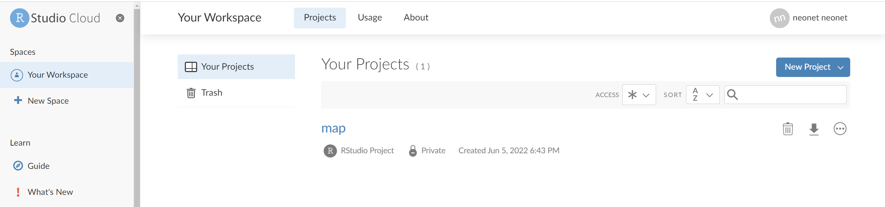
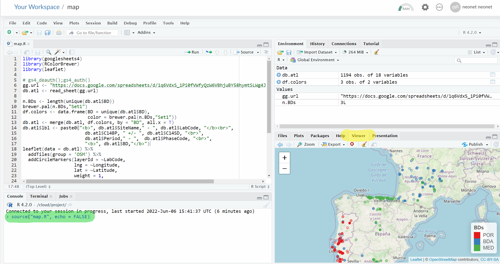

## Pastclim - NeoNet

* NeoNet
    - same name as a working group NeoNet but different (dates gathering and IT developments)
        - 8 persons
    - radiocarbon dates 
        - divided today on cultural periods, mostly of Late Mesolithic and Early Neolithic
        - high value to assess change over time
        - one the most standardised archaeological proxy
    - online open-source web app (selection by time and spatial windows) offering a high reusability of the dataset and reproductibility of the analysis (export, R functions,c14bazAAAR)
    - aims:
        - be able to be accurate possible on the spatio-temporal diffusion process and its geographical scale 
        - IT: reusability, reproductibility of quantitative analysis (ex: spatial diffusion), OxCal, Open Science
        - Archaeological: spread of farming a major social shift
* NeoNet-pastclim collaboration aims
    - integrated Koppen CC in the dev app 
    - Koppen: various natural frontiers (ex: Central European-Balkanic Agro-Ecological Barrier, CEBAEB) or corridors have been identified

<p align="center">
<br>
  
  
  
  <br>
    <em>Possible barriers and "ecological niches"</em>
</p>

### Simep

proposed communication: *Social Interactions in Mediterranean Prehistory, 21-23 October, Barcelona, session: Environment and social interactions – Chairwoman: Eleni Asouti. CoP deadline: 22 Avril*, https://simep2024.com/743-2-2/ 

<p align="center">
<br>
  
  
  <br>
    <em>Do this on that</em>
</p>

Selected area (region of interest, ROI, see [here](https://github.com/zoometh/neonet/blob/main/doc/talks/2024-simep/roi.geojson
)):

<p align="center">
<br>
  
  <br>
    <em>ROI</em>
</p>

Retrieve data from these databases in c14bazAAR (`calpal`, `medafricarbon`, `agrichange`, `neonet`, `bda`, `calpal`, `radon`, `katsianis`):

<p align="center">
<br>
  
  
  <br>
    <em>Sample of selected DBs</em>
</p>


## Resources


### NeoNet atlantic

* dataset:
https://docs.google.com/spreadsheets/d/1q6VdxS_1Pi0fVWfyQzW6VBhjuBY58hymtSLWg4JyLEA/edit?usp=sharing&urp=gmail_link

* bibliographical references:
https://drive.google.com/file/d/1etzPAp8dL7HFpkMKlATbw3BvauxbaBWE/view?usp=sharing

* thesaurus:
https://docs.google.com/spreadsheets/d/1cTj7c6W2anZ7-j2isivZ0xW4SlO3TB4fexwXRvaRSQ0/edit?usp=sharing

### Other ressources

* Current distribution map
https://zoometh.github.io/neonet/results/neonet_atl

* GitHub of the app:
https://github.com/zoometh/neonet

* Tutorial of the app & dataset:
https://zoometh.github.io/neonet/

* App:
http://shinyserver.cfs.unipi.it:3838/C14/

* JOAD article:
https://openarchaeologydata.metajnl.com/articles/10.5334/joad.87/

### Interactive map

After editing the Google Sheet, see the results on a map

1. Log In https://rstudio.cloud/

    - *Email*: neonet.radiocarbon@gmail.com
    - *Password*: neonet-radi0c@rbon

2. Open the project **map**



3. In the console window (bottom-left, in <span style="color:green"><b>green</b></span>), run: 
```
source("map.R", echo = FALSE)
```   

4. To see the computed map, select the **Viewer** panel in the graphical output window (bottom-right, in <span style="color:yellow"><b>yellow</b></span>)



5. Enlarge the map size clicking on Zoom (🔎) below the **Viewer** panel

## 220600
> Tasks (proposal)

* Niccolo:
    - Overall standardization
    - Relation with the IT service of the University of Pisa

* Thomas: 
    - Standardization of the Atlantic dataset
    - App & GitHub & tutorial maintenance
    - FAIRisation (`get_neonet()` function)

* Gregor:
    - France dataset & bibliographical references

* Miriam & Gibi & FX:
    - Spain dataset & bibliographical references

* Antonio & Ana:
    - Portugal dataset & bibliographical references
    
## 220900

